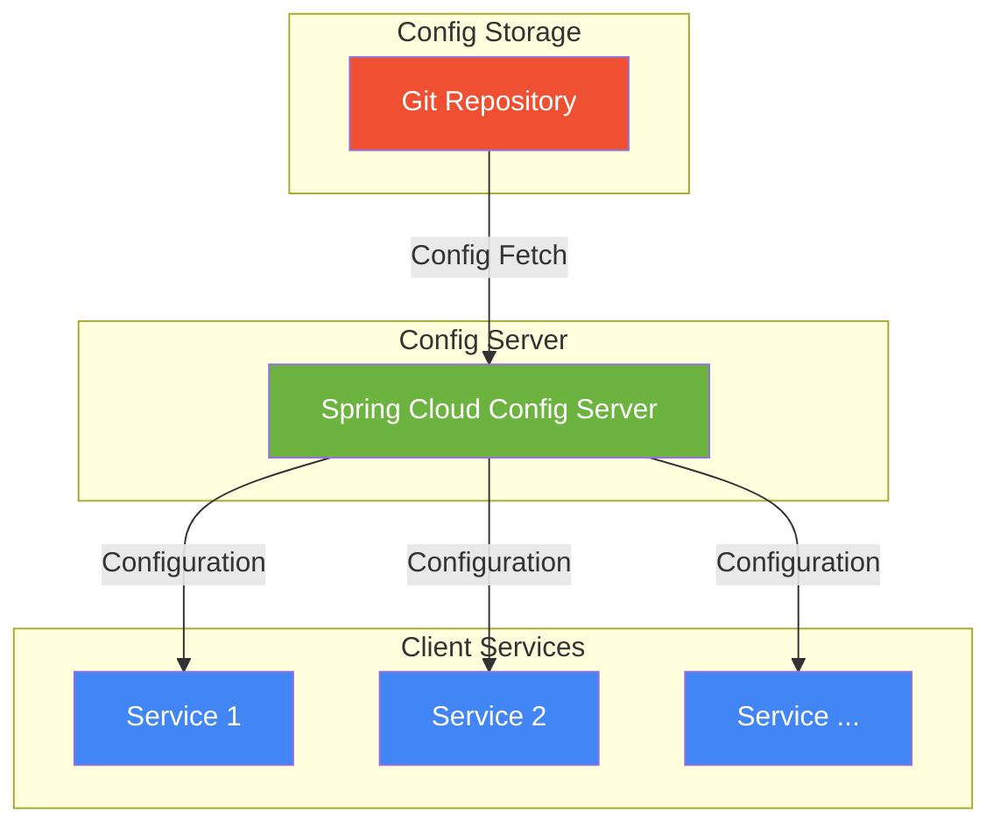
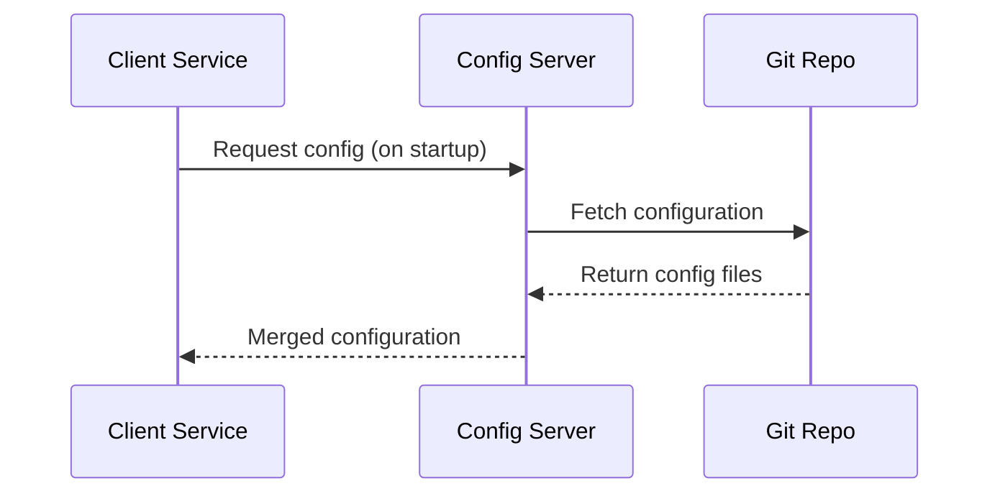

# Configuration Server

*Provides centralized configuration management for microservices in distributed applications.*

- [Tech Stack](#tech-stack)
- [Key Features](#key-features)
- [Architecture Overview](#architecture-overview)
- [Client Service Setup](#client-service-setup)
- [Profile Activation Methods](#profile-activation-methods)
- [Getting Started](#getting-started)
  - [1. Running via JAR File](#1-running-via-jar-file)

### Tech Stack

- Java 21
- Spring Boot 3.5
- Gradle 8.14
- Spring Cloud Version 2025.0.0
- Spring Boot Actuator
- [Git backend for configuration storage](https://github.com/ByteB00k/Bytebook-config-repo)

### Key Features

- **Versioned Configuration**: All configurations stored in Git with full history
- **Environment Profiles**: Supports dev/test/stage/prod environments
- **Sensitive Data Protection**: Built-in encryption/decryption endpoints
- **Operational Visibility**: Actuator health checks

### Architecture Overview





### Client Service Setup

Minimal `application.yml` configuration for client services:

```yaml
spring:
  application:
    name: client-service # Service ID for config lookup
  config:
    import:
      - configserver:http://localhost:8071 # Config Server endpoint
```

### Profile Activation Methods

Spring Cloud Config supports multiple profile activation approaches:

1. **Via Environment Variables/JVM Flags**

IntelliJ IDEA (Run Configuration):

```text
VM Options: -Dspring.profiles.active=dev
```

Command Line:

```bash
java -jar app.jar --spring.profiles.active=dev
```

2. **Docker Environment**

Dockerfile:

```dockerfile
ENV SPRING_PROFILES_ACTIVE=dev
```

docker-compose.yml:

```yaml
services:
  config-server:
    environment:
      - SPRING_PROFILES_ACTIVE=dev
```

Container launch:

```bash
docker run -e "SPRING_PROFILES_ACTIVE=dev" image-name
```

3. **Configuration Files**

application.yml/bootstrap.yml:

```yaml
spring:
  profiles:
    active: dev
```

### Getting Started

#### 1. Running via JAR File

- Clone the repository:

```bash
git clone https://github.com/ByteB00k/ByteBook-config-server.git
cd ByteBook-config-server
```

- Build the application:

```bash
./gradlew clean build
```

- Run the JAR file (default port 8882) with custom profile:

```bash
java -Dspring.profiles.active=dev -jar build/libs/app.jar
```

- Verify (in another terminal):

```bash
curl http://localhost:8888/actuator/health
```